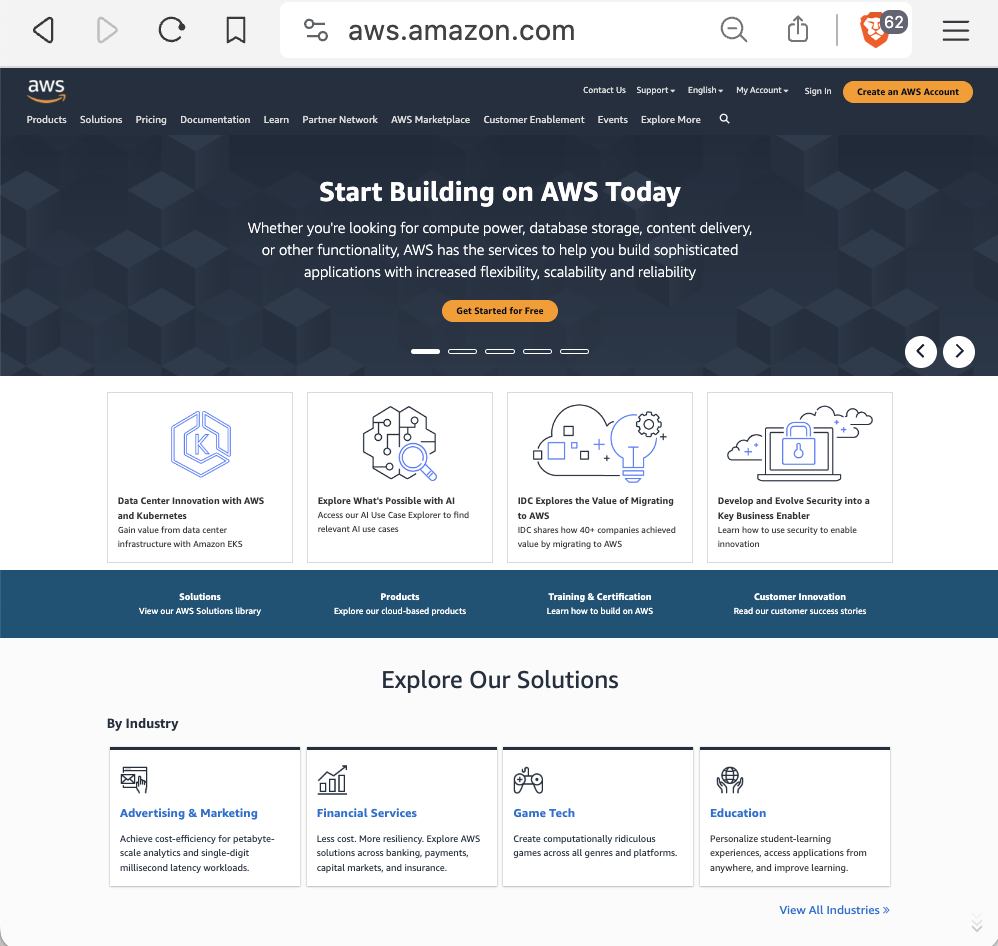

# How to Set Up an S3 Bucket as a Website

The following details the steps for setting up an S3 bucket as a website.

1. Go to: https://aws.amazon.com

1. Go to: https://aws.amazon.com

1. Go to: https://aws.amazon.com

1. Go to: https://aws.amazon.com

1. Go to: https://aws.amazon.com

1. Go to: https://aws.amazon.com

1. Go to: https://aws.amazon.com

1. Go to: https://aws.amazon.com

1. Go to: https://aws.amazon.com

1. Go to: https://aws.amazon.com

1. Go to: https://aws.amazon.com

1. Go to: https://aws.amazon.com

1. Go to: https://aws.amazon.com

1. Go to: https://aws.amazon.com

1. Go to: https://aws.amazon.com

1. Go to: https://aws.amazon.com

1. Go to: https://aws.amazon.com

1. Go to: https://aws.amazon.com

1. Go to: https://aws.amazon.com

1. Go to: https://aws.amazon.com

1. Go to: https://aws.amazon.com

1. Go to: https://aws.amazon.com

1. Go to: https://aws.amazon.com

1. Go to: https://aws.amazon.com

1. Go to: https://aws.amazon.com

1. Go to: https://aws.amazon.com

1. Go to: https://aws.amazon.com

1. Go to: https://aws.amazon.com

1. Go to: https://aws.amazon.com

1. Go to: https://aws.amazon.com

1. Go to: https://aws.amazon.com

1. Go to: https://aws.amazon.com

1. Go to: https://aws.amazon.com

1. Go to: https://aws.amazon.com

1. Go to: https://aws.amazon.com

1. Go to: https://aws.amazon.com

1. Go to: https://aws.amazon.com

1. Go to: https://aws.amazon.com

1. Go to: https://aws.amazon.com

1. Go to: https://aws.amazon.com

