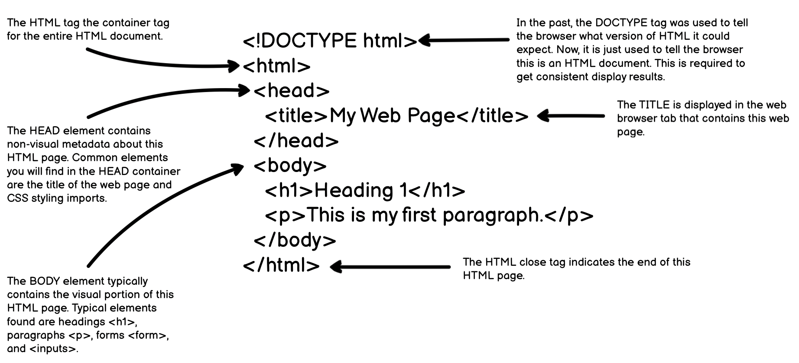

## Anatomy of an HTML Page

In this lesson, we will learn what an HTML element is, how a tag is constructed, and the anaotomy of a typical HTML page.

Here is an example of a basic HTML page:



The `<!DOCTYPE html>` tells the web browser what rules this HTML page follows. There used to be different HTML versions that followed different rules. This is not really the case anymore, so `<!DOCTYPE html>` is all that is needed.

The `<html>` element holds the contents of the HTML page.

The `<head>` element 

### What is an HTML element

An HTML page is made up of several HTML elements, each handling a specific purpose.

#### HTML Element Tags

An HTML element typically has an opening and closing HTML tag. Some HTML elements do not require a closing HTML tag.

HTML close tags are the same as their HTML open tags except they are preceded with a forward slash `/`.

For example, a paragraph element has an opening tag `<p>` and a closing tag `</p>`.

Here is a paragraph element example:

```html
<p>This is a basic paragraph HTML element</p>
```

#### HTML Element Attributes

HTML tag has optional attributes that are used to further define the look and/or behavior of the HTML tag.


Each HTML tag can have various attributes, but all tags share some common attributes. The attributes most often used are shown in this example:

```html
<p class="my-paragraph" id="my-first-paragraph" title="My first paragraph" style="font-weight: bold;">This is my first paragraph.</p>
```